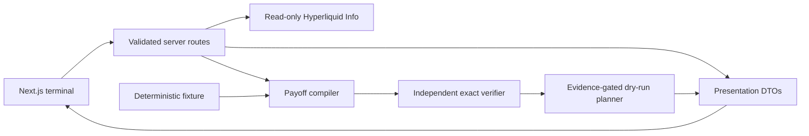

# Contour · BUILD 04

Contour compiles a requested BTC settlement payoff into a liquidity-aware HIP-4 binary-outcome construction, then independently verifies the exact result. BUILD 04 hardens the hosted demo, live read-only data path, public API boundaries, and deployment checks without changing the financial model or BUILD 03.1 execution-evidence rules.

## Try it

Requirements: Node.js 22.12 or newer and pnpm 11.15.1.

```sh
pnpm install --frozen-lockfile
pnpm dev
```

Open `http://localhost:3000`, leave **Verified Fixture Demo** selected, and press **Run verified demo**. This deterministic fixture requires no account, secrets, wallet, or upstream service. **Live Market** uses public read-only Hyperliquid Info reads; provider trouble is shown as unavailable and is never replaced with fixture data.

## Checks and production smoke

```sh
pnpm lint
pnpm typecheck
pnpm test
pnpm build
pnpm start
# in another terminal, after the production server is listening:
pnpm smoke:production -- http://localhost:3000
```

GitHub Actions runs the four quality gates on pushes and pull requests. The production smoke check exercises both pages, build/runtime health identity, fixture compilation and dry-run preview, security headers, and a method guard. Optional external probes are documented below and are intentionally not CI dependencies:

```sh
pnpm probe:markets
pnpm probe:compiler:fixture
pnpm probe:execution:fixture
```

## What the product does—and does not do

- Compiles terminal payoff intent, book depth, and a fixed settlement range.
- Keeps exact payoff verification distinct from the sampled chart.
- Presents execution planning only as a snapshot-bound dry run; BUILD 03.1 evidence and strict-mainnet blockers remain authoritative.
- Reads public market/account data only. It has no wallet connection, private-key handling, signing, approval, order submission, broadcast, custody, or liquidation guarantee.
- Excludes fees where stated and cannot guarantee later liquidity, fills, slippage, settlement interpretation, or venue availability.

## Deployment

See [deployment and operations](docs/DEPLOYMENT.md) for Vercel setup, environment policy, cache behavior, health checks, and rollback guidance. No application secrets or environment variables are required. [BUILD 04 technical brief](docs/HACKATHON_TECHNICAL_BRIEF.md) summarizes architecture, trust boundaries, resilience, and verification evidence.

Further detail: [architecture](docs/ARCHITECTURE.md), [web terminal](docs/WEB_TERMINAL.md), [compiler](docs/COMPILER.md), [payoff model](docs/PAYOFF_MODEL.md), [execution planner](docs/EXECUTION_PLANNER.md), [protocol evidence](docs/PROTOCOL_EXECUTION_EVIDENCE.md), and [security](docs/SECURITY.md).


